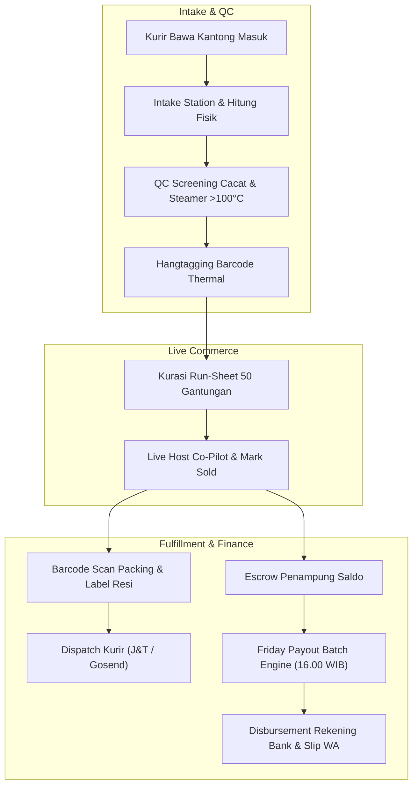
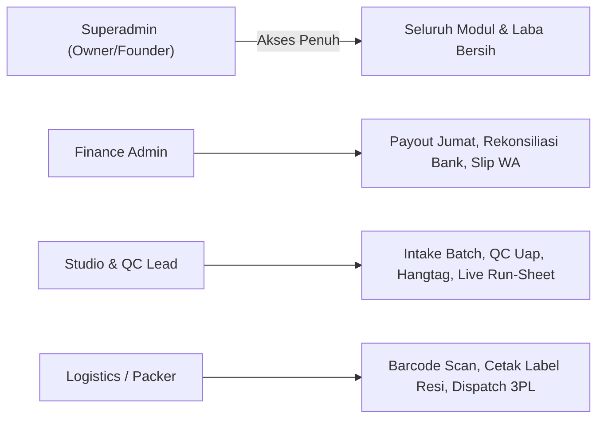
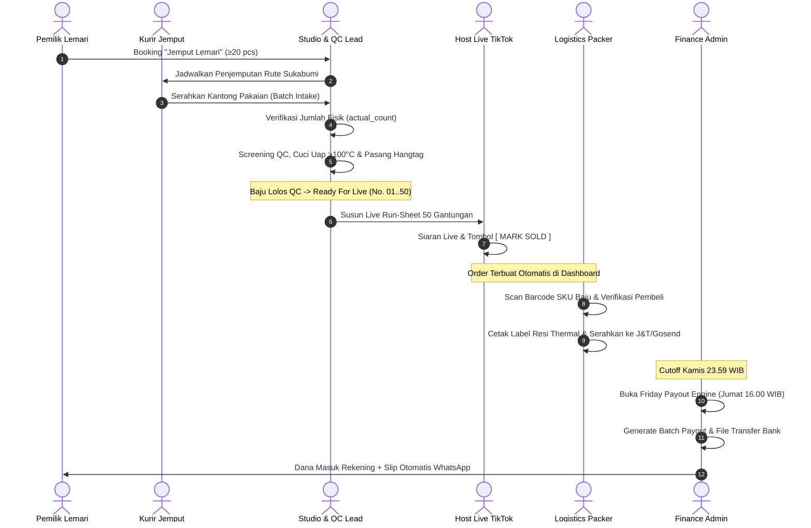
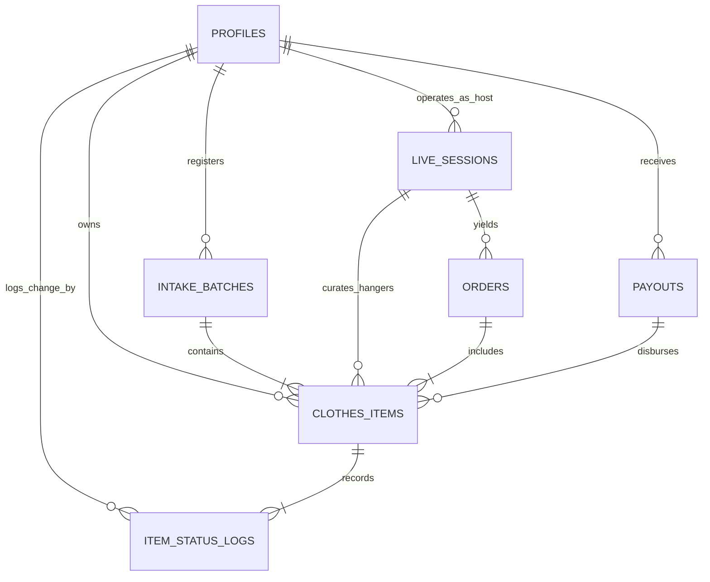
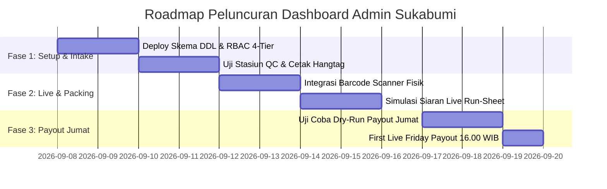

# 🏢 PRODUCT REQUIREMENT DOCUMENT (PRD) v1.0
## PindahTangan — All-in-One Operations, Fulfillment & Finance Admin Suite

> **Visi Sistem:** *"Sentralisasi Operasional, Kurasi Studio & Automasi Finansial Fesyen Sirkular Terkelola — Dari Kantong Masuk hingga Gajian Tiap Jumat."*  
> **Status:** APPROVED & AUDITABLE (Diselaraskan via `/grill-me`).  
> **Target Pengguna Internal:** Studio Lead, Petugas QC & Steamer, Staf Logistik/Packer, Finance Admin, dan Superadmin (Owner).  
> **Basis Rujukan Utama:** [Master PRD PindahTangan v1.0](file:///Users/akmalirsyadpermana/Downloads/Pindah%20Tangan/PindahTangan%20-%20Product%20Requirement%20Document%20%28PRD%29%20v1.0.md).

---

## 📑 DAFTAR ISI

1. **Executive Summary & System Objectives**
2. **Role-Based Access Control (RBAC) & Persona Internal**
3. **Arsitektur Alur Kerja Terintegrasi (End-to-End Workflow)**
4. **Spesifikasi Detail Fitur & Modul Fungsional**
   * 4.1 Modul 1: Studio Intake, QC 3-Stasiun & Hangtagging Engine
   * 4.2 Modul 2: Live Commerce Orchestration & Host Co-Pilot
   * 4.3 Modul 3: Order Fulfillment, Barcode Scanning & 3PL Shipping Dispatch
   * 4.4 Modul 4: Friday Payout Batch Engine & Financial Escrow
   * 4.5 Modul 5: 30-Day Aging Engine & Pasokan Obral Ceban
   * 4.6 Modul 6: Executive Analytics, Unit Economics & CSV Reporting
5. **Skema Relasional Database & Kamus Data Admin**
6. **Spesifikasi API & Kontrak Data Antar-Modul**
7. **Desain Antarmuka & Wireframe Flow (Warm Editorial Chic)**
8. **Keamanan, Audit Immutability & Non-Functional SLAs**
9. **Rencana Peluncuran & Pengujian Operasional Studio Sukabumi**

---

## 1. Executive Summary & System Objectives

Dashboard Admin PindahTangan adalah pusat kendali (*operations nervous system*) bagi seluruh aktivitas bisnis konsinyasi fesyen terkelola di studio fisik (Jl. Siliwangi No. 102, Kota Sukabumi). 

Dashboard ini menghilangkan fragmentasi operasional antara penanganan fisik baju (QC, uap panas, gantungan), penjualan langsung (Live TikTok / Instagram), pengemasan pesanan pembeli, dan pembayaran bagi hasil kepada ribuan penitip pakaian (*consignors*).



### 1.1 Objektif Bisnis & KPI Utama
1. **Zero-Error Packing SLA:** Menghilangkan salah kirim baju pembeli dengan verifikasi scanner barcode SKU fisik $100\%$.
2. **Same-Day QC SLA:** Baju yang dijemput masuk stasiun uap dan ber-hangtag dalam tempo $< 24\text{ jam}$.
3. **Punctual Friday Payout:** Rekonsiliasi kas dan eksekusi gajian mingguan tepat pukul 16.00 WIB setiap hari Jumat dengan potongan biaya cuci uap deduktif Rp 2.500/pcs yang presisi.
4. **Live Velocity Maximization:** Mempersiapkan antrean gantungan No. 01–50 siap siaran live sehingga host dapat menjual 30–50 potong baju per shift 2 jam tanpa jeda teknis.

---

## 2. Role-Based Access Control (RBAC) & Persona Internal

Dashboard menerapkan kontrol akses 4-tingkat (*granular 4-tier RBAC*) untuk menjaga keamanan kas, privasi data rekening nasabah, dan integritas inventaris:



### 2.1 Matriks Izin Akses (Permission Matrix)

| Modul / Tindakan | Superadmin | Finance Admin | Studio & QC Lead | Logistics / Packer |
| :--- | :---: | :---: | :---: | :---: |
| **Lihat Metrik Laba Bersih Platform** | ✅ | ✅ | ❌ | ❌ |
| **Simulasi Unit Economics Eksekutif** | ✅ | ✅ | ❌ | ❌ |
| **Eksekusi Batch Payout Jumat 16.00** | ✅ | ✅ | ❌ | ❌ |
| **Edit Nomor Rekening Bank Penitip** | ✅ | ✅ | ❌ | ❌ |
| **Ekspor CSV Batch Transfer Bank** | ✅ | ✅ | ❌ | ❌ |
| **Verifikasi Kantong Masuk (Intake)** | ✅ | ❌ | ✅ | ❌ |
| **Input QC & Catatan Reject/Foto** | ✅ | ❌ | ✅ | ❌ |
| **Generate & Cetak Hangtag Barcode** | ✅ | ❌ | ✅ | ❌ |
| **Kurasi Run-Sheet Siaran Live (No. 1–50)**| ✅ | ❌ | ✅ | ❌ |
| **Penyesuaian Harga Saat Live (Co-Pilot)** | ✅ | ❌ | ✅ | ❌ |
| **Scan Barcode Verifikasi Packing** | ✅ | ❌ | ❌ | ✅ |
| **Cetak Label Resi Thermal Pengiriman** | ✅ | ❌ | ❌ | ✅ |
| **Update Status Resi & Dispatch Kurir** | ✅ | ❌ | ❌ | ✅ |
| **Eksekusi Beli Putus Obral Ceban** | ✅ | ✅ | ✅ | ❌ |

---

## 3. Arsitektur Alur Kerja Terintegrasi (End-to-End Workflow)



---

## 4. Spesifikasi Detail Fitur & Modul Fungsional

### 4.1 Modul 1: Studio Intake, QC 3-Stasiun & Hangtagging Engine

#### A. Intake Batch Registration & Manifest
1. **Verifikasi Fisik Kantong:**
   * Menampilkan daftar kedatangan kurir berstatus `scheduled` dan `picked_up`.
   * Operator memasukkan jumlah riil pakaian (`actual_count`).
   * Jika ada selisih antara `estimated_count` dan `actual_count`, sistem mencatat deviasi pada catatan intake.
2. **Status Lifecyle Batch:**
   * `scheduled` $\to$ `picked_up` $\to$ `in_qc` $\to$ `completed`.

#### B. QC Screening & Cuci Uap Panas
1. **Pemeriksaan 5 Parameter Kerusakan:**
   * Noda permanen (tinta, minyak, jamur).
   * Sobek / bolong kain.
   * Resleting macet / patah.
   * Kancing utama hilang / copot.
   * Bau apek membandel.
2. **Alur Barang Lolos QC:**
   * Operator menginput: Judul baju, Brand, Ukuran (XS–XXL, All Size), Lingkar Dada (LD cm), dan Kategori Tier (`tier_a`, `tier_b`, `tier_c`).
   * Sistem menetapkan *Floor Price* (Hak Bersih Consignor) dan merekomendasikan *Target Live Price* sesuai formula margin.
   * Pakaian masuk status `in_steam` untuk sterilisasi uap suhu $> 100^\circ\text{C}$ dan penyemprotan *fabric mist*.
3. **Alur Barang Reject QC:**
   * Operator mengambil 1 foto jelas bagian cacat via webcam/HP.
   * Memilih kategori cacat dan menuliskan catatan detail kerusakan.
   * Status pakaian disetel ke `rejected`.
   * Terbit notifikasi otomatis ke portal pemilik baju dengan opsi interaktif:
     * `[ Relakan untuk Didonasi / Daur Ulang ]`
     * `[ Ambil Kembali Saat Payout / Retur ]`

#### C. Thermal Hangtag Generator
* Format label thermal ukuran $10 \times 15\text{ cm}$ standar printer POS/Thermal:
  * Nomor display gantungan besar: `No. 42` (terbaca jelas dari jarak $2\text{ meter}$ di kamera smartphone).
  * Barcode Code-128 & SKU fisik: `PT-SM-001-042`.
  * Brand, Ukuran, Lingkar Dada (LD cm).
  * Floor Price & Rekomendasi Buka Live (hanya untuk panduan operator studio).

---

### 4.2 Modul 2: Live Commerce Orchestration & Host Co-Pilot

#### A. Penjadwalan Sesi Siaran (Live Session Scheduler)
* Kalender siaran terbagi dalam 3 slot harian sesuai karakter pembeli:
  * **Sesi Siang (14.00–16.00 WIB):** Tier C (Mass market, kaos, celana harian, obral ceban).
  * **Sesi Sore (16.00–18.00 WIB):** Tier B (Casual chic, blouse katun, kemeja kerja, kulot linen).
  * **Sesi Malam (20.00–22.00 WIB):** Tier A (Brand mall, gamis pesta, gaun kondangan, outer premium).
* Penugasan Host Talent ke sesi siaran beserta pencatatan jam check-in.

#### B. Run-Sheet Builder (50 Gantungan)
* Antarmuka visual drag-and-drop untuk memilih 50 potong pakaian berstatus `ready_for_live` ke dalam urutan gantungan live (`No. 01` hingga `No. 50`).
* Fitur *Fast-Reorder*: Geser baju yang paling menarik ke urutan depan saat siaran baru dibuka untuk memancing penonton awal (*hook engagement*).

#### C. Live Telemetry & Studio Co-Pilot
* Layar pendamping admin saat siaran berlangsung:
  * Memantau gantungan aktif yang sedang dipamerkan host di ring-light.
  * Tombol darurat *Price Adjustment* jika penonton menawar di kolom komentar live: admin dapat menyetujui penurunan harga sepanjang tidak melanggar batas *Floor Price*.
  * Realtime ticker: Pakaian terjual, total GMV sesi, dan konversi penonton.

#### D. Host Payroll Calculation Engine
* Menghitung honor host secara otomatis per sesi siaran:
  $$\text{Total Honor Host} = \text{Rp } 60.000 + (N_{\text{sold}} \times \text{Rp } 2.000)$$
* Menghasilkan slip rekap gaji shift talent mingguan.

---

### 4.3 Modul 3: Order Fulfillment, Barcode Scanning & 3PL Shipping Dispatch

#### A. Order Aggregation Engine
* Setiap kali tombol `[ MARK SOLD ]` ditekan oleh host, sistem langsung membentuk entitas `orders` baru yang memuat:
  * Username TikTok/IG pembeli (misal: `@siti_ootd`).
  * Detail baju yang dibeli (SKU, Brand, Hangtag No).
  * Subtotal harga laku akhir.
  * Ongkos kirim flat (Lokal Sukabumi Rp 10.000 / Luar Kota Rp 12.000–15.000).

#### B. Barcode Scan Verification Station
* Untuk mencegah insiden salah kemas baju:
  1. Petugas packer memindai barcode pesanan pada form order.
  2. Petugas memindai barcode hangtag fisik baju menggunakan barcode scanner / kamera.
  3. Sistem memvalidasi: Jika SKU cocok $\to$ lampu hijau & bunyi beep konfirmasi. Jika salah baju $\to$ lampu merah & alarm peringatan.

#### C. Thermal Shipping Label & Airway Bill (AWB) Printing
* Mencetak label pengiriman thermal $10 \times 15\text{ cm}$ langsung dari peramban:
  * Nama, alamat lengkap, dan nomor WhatsApp penerima.
  * Nama ekspedisi & barcode nomor resi.
  * Rincian isi paket (disamarkan dengan nama elegan demi privasi pembeli).

#### D. Bulk 3PL Shipping Dispatch
* Pengelompokan paket berdasarkan ekspedisi mitra:
  * **J&T Express:** Kurir drop-point jemput paket harian pukul 17.30 WIB.
  * **SiCepat Express:** Pengiriman nasional.
  * **Gosend Instant / GrabExpress:** Khusus pembeli di 7 kecamatan Kota Sukabumi.
* Tombol *Bulk Dispatch*: Mengubah status seluruh pesanan dalam batch ke `shipped` dan mengirimkan tautan pelacakan nomor resi otomatis ke WhatsApp pembeli.

---

### 4.4 Modul 4: Friday Payout Batch Engine & Financial Escrow

#### A. Aturan Bisnis & Periode Cutoff Mingguan
* **Jadwal Pencairan:** Setiap hari **Jumat pukul 16.00 WIB**.
* **Periode Penjualan:** Sabtu minggu lalu pukul 00.00 WIB hingga Kamis minggu ini pukul 23.59 WIB.
* Pakaian yang terjual hari Jumat masuk ke siklus payout Jumat pekan berikutnya.

#### B. Formula Perhitungan Bersih Hak Penitip (Consignor)
Untuk setiap penitip $C$ dengan pakaian terjual sejumlah $k$ potong:
$$\begin{aligned}
\text{Total Gross Floor} &= \sum_{i=1}^{k} P_{\text{floor}, i} \\
\text{Total Deduksi Cuci Uap} &= k \times \text{Rp } 2.500 \\
\text{Total Net Payout} &= \max(0, \text{Total Gross Floor} - \text{Total Deduksi Cuci Uap})
\end{aligned}$$

#### C. Alur Eksekusi Hybrid (Batch Bank CSV & API Readiness)
1. **Verifikasi Pra-Payout:**
   * Sistem memeriksa kelengkapan nomor rekening dan nama pemilik rekening seluruh consignor. Jika rekening belum lengkap, sistem menampilkan tag peringatan kuning (*Action Required*).
2. **Generasi File Batch Bank:**
   * Ekspor format file CSV transfer massal standar perbankan:
     * **BCA KlikBisnis Payroll Format:** `[Nomor Rekening, Nama, Nominal, Keterangan]`.
     * **Bank Mandiri MCM Format.**
3. **Eksekusi Batch & Transaksi Bersih:**
   * Admin menekan tombol konfirmasi *“Eksekusi Payout Jumat 16.00 WIB”*.
   * Sistem menandai seluruh baris pakaian terkait dengan status `paid_out` dan mengaitkan `payout_id`.
   * Menerbitkan nomor kode transfer unik (`PAY-YYYYMMDD-XXX`).
4. **Distribusi Slip Transfer Digital WhatsApp:**
   * Menerbitkan slip digital PDF/Gambar resmi dengan rincian transparan (gross, potongan cuci uap, net transfer).
   * Tautan slip otomatis dikirimkan via integrasi WhatsApp API ke nomor pemilik pakaian.

---

### 4.5 Modul 5: 30-Day Aging Engine & Pasokan Obral Ceban

#### A. Deteksi Umur Konsinyasi Realtime
* Sistem menghitung sisa masa konsinyasi tiap pakaian:
  $$\text{Sisa Hari} = \text{aging\_expiry\_date} - \text{CURRENT\_DATE}$$
* Peringatan bertahap di dashboard admin:
  * **Hari 1–20:** Masa konsinyasi normal (Live Tier A/B).
  * **Hari 21–29:** Peringatan kuning (Diskon rekomendasi live $15\%$).
  * **Hari $\ge 30$:** Masuk batas retensi kadaluwarsa.

#### B. Opsi Beli Putus Obral Ceban (Rp 10.000/pcs)
* Sesuai PRD Master Seksi 5.4:
  * Pemilik pakaian menerima penawaran beli putus tunai sebesar **Rp 10.000 / potong** daripada pakaian kembali mengotori lemari.
  * Jika disetujui, pakaian berubah status menjadi `bought_out`, uang Rp 10.000 ditambahkan ke payout Jumat penitip, dan hak milik berpindah sepenuhnya ke platform.
  * Pakaian dialihkan ke katalog khusus siaran **Live TikTok Huru-Hara "Serba Ceban (Rp10.000)"** yang secara algoritma sangat viral dan mendatangkan ratusan penonton baru ke akun studio Sukabumi.

---

### 4.6 Modul 6: Executive Analytics, Unit Economics & CSV Reporting

#### A. Metrik KPI Eksekutif Realtime
* **Total Gross Merchandise Value (GMV):** Akumulasi omzet kotor penjualan live.
* **Platform Gross Margin:**
  $$\text{Gross Margin} = \sum (P_{\text{sold}} - P_{\text{floor}}) + (N_{\text{sold}} \times \text{Rp } 2.500)$$
* **Platform Net Profit:**
  $$\text{Net Profit} = \text{Gross Margin} - \text{Total Biaya Host (Gaji Pokok + Bonus)}$$
* **Tingkat Kelolosan QC Studio:** Persentase pakaian lolos vs reject.
* **Sold-Out Ratio per Sesi Live:** Rata-rata persentase gantungan yang laku terjual per siaran 2 jam (target benchmark: $\ge 60\%$).

#### B. Ekspor Laporan Pembukuan (CSV/Excel)
* Tombol satu klik ekspor:
  * Laporan Penjualan Harian & Mingguan.
  * Laporan Rekonsiliasi Kas Payout Jumat.
  * Laporan Stok Inventaris Aktif Studio.
  * Riwayat Log Audit Perubahan Status (`item_status_logs`).

---

## 5. Skema Relasional Database & Kamus Data Admin



### 5.1 Definisi Kolom Khusus Admin Dashboard

#### 1. Tabel `profiles` (Penambahan Atribut RBAC Internal)
* `admin_tier` (TEXT): `superadmin`, `finance`, `studio_lead`, `logistics`, `none`.
* `is_active_staff` (BOOLEAN, DEFAULT FALSE): Penanda akun staf studio aktif.

#### 2. Tabel `clothes_items` (Penambahan Pelacakan Fisik Studio)
* `rack_location` (TEXT, DEFAULT 'RACK-A'): Posisi rak gantung fisik di studio Sukabumi.
* `inspection_notes` (TEXT): Catatan internal pemeriksa QC.
* `inspected_by` (UUID, FK to `profiles.id`): ID staf yang melakukan QC uap.

#### 3. Tabel `orders` (Penambahan Pelacakan Pengemasan)
* `packed_by` (UUID, FK to `profiles.id`): Staf logistik yang memverifikasi barcode scan.
* `packed_at` (TIMESTAMPTZ): Waktu paket selesai dibungkus dan ditempel resi.
* `dispatched_at` (TIMESTAMPTZ): Waktu paket diserahkan ke kurir J&T/Gosend.

---

## 6. Spesifikasi API & Kontrak Data Antar-Modul

### 6.1 Endpoint: Intake & QC

```typescript
// POST /api/admin/intake/receive
Request: {
  batchId: string;
  actualCount: number;
  notes?: string;
}
Response: {
  success: boolean;
  batch: IntakeBatch;
}

// POST /api/admin/qc/inspect
Request: {
  batchId: string;
  consignorId: string;
  isPassed: boolean;
  title: string;
  brand: string;
  size: string;
  chestWidthCm?: number;
  categoryTier: 'tier_a' | 'tier_b' | 'tier_c';
  floorPrice: number;
  targetLivePrice: number;
  defectReason?: string;
  defectNotes?: string;
  defectPhotoUrl?: string;
}
Response: {
  success: boolean;
  item: ClothesItem;
  thermalHangtagHtml: string;
}
```

### 6.2 Endpoint: Order Packing & Barcode Scan

```typescript
// POST /api/admin/fulfillment/verify-scan
Request: {
  orderId: string;
  scannedSku: string;
}
Response: {
  matched: boolean;
  message: string;
  orderStatus: 'pending_pack' | 'packed';
}

// POST /api/admin/fulfillment/dispatch
Request: {
  orderIds: string[];
  courierName: string;
}
Response: {
  dispatchedCount: number;
  trackingUpdates: Array<{ orderId: string; trackingNumber: string }>;
}
```

### 6.3 Endpoint: Friday Payout Batch Engine

```typescript
// POST /api/admin/payouts/execute-batch
Request: {
  cutoffDateStart: string; // YYYY-MM-DD
  cutoffDateEnd: string;   // YYYY-MM-DD
}
Response: {
  batchCode: string;
  totalConsignors: number;
  totalGrossFloor: number;
  totalSteamDeductions: number;
  totalNetDisbursed: number;
  payoutsGenerated: Payout[];
  bankCsvDownloadUrl: string;
}
```

---

## 7. Desain Antarmuka & Wireframe Flow (Warm Editorial Chic)

Sesuai standar desain PindahTangan, dashboard admin menggunakan estetika **Warm Editorial Chic** yang berwibawa, bersih, dan jauh dari kesan template AI generik:
* **Warna Dasar:** Kanvas linen lembut (`#FAF7F2`), batas garis tipis (`#E7E2D8`), tipografi espresso pekat (`#1C1917`), dan aksen terracotta butik (`#C25E43`).
* **Tipografi:** Kombinasi serif `Playfair Display` untuk judul dokumen finansial dan `Plus Jakarta Sans` dipadu angka monospace untuk data numerik & kode transaksi.

### 7.1 Tata Letak Navigasi Admin
```
+-----------------------------------------------------------------------------------+
|  PINDAHTANGAN ATELIER  •  STUDIO BACKOFFICE SUKABUMI               [Superadmin ▾] |
+--------------------+--------------------------------------------------------------+
| 📊 Executive KPI   | [Overview Metrik GMV, Laba Bersih & Rasio Terjual Live]      |
| 🧺 Studio & QC Hub | ------------------------------------------------------------ |
| 👗 Live Run-Sheet  | [Antrean Batch Kantong Masuk] | [Stasiun Cuci Uap & Hangtag] |
| 📦 Fulfillment     | ------------------------------------------------------------ |
| 💰 Payout Jumat    | [Tabel Agregasi Payout Jumat] -> [Tombol Eksekusi Batch]     |
| 🏷️ Retensi 30 Hari | ------------------------------------------------------------ |
| 📈 Laporan CSV     | [Daftar Pesanan Live] -> [Scan Barcode SKU] -> [Dispatch J&T]|
+--------------------+--------------------------------------------------------------+
```

---

## 8. Keamanan, Audit Immutability & Non-Functional SLAs

1. **Audit Trail Immutability (Append-Only):**
   * Seluruh perubahan status inventaris (`in_steam` $\to$ `ready_for_live` $\to$ `sold` $\to$ `paid_out`) otomatis dicatat dalam tabel `item_status_logs` dengan ID staf pengubah dan timestamp presisi via trigger database PostgreSQL.
   * Tidak ada izin `UPDATE` atau `DELETE` pada tabel `item_status_logs`.
2. **Keamanan Transaksi Finansial:**
   * Eksekusi payout Jumat dilindungi dengan konfirmasi ganda modal dan pencatatan IP admin.
   * Data nomor rekening bank dienkripsi saat transit (*in-transit via SSL HTTPS*) dan di-*masking* sebagian pada tampilan staf non-finance (misal: `0281****71`).
3. **Response Time & Operabilitas Lokal:**
   * Pemuatan antrean run-sheet live 50 gantungan $< 100\text{ ms}$.
   * Dukungan pencetakan thermal langsung (*native browser print dialog*) tanpa popup tambahan.

---

## 9. Rencana Peluncuran & Pengujian Operasional Studio Sukabumi



---

## 🔗 Referensi Silang Vault
* [Master PRD PindahTangan v1.0](file:///Users/akmalirsyadpermana/Downloads/Pindah%20Tangan/PindahTangan%20-%20Product%20Requirement%20Document%20%28PRD%29%20v1.0.md)
* [Skrip DDL Supabase PostgreSQL](file:///Users/akmalirsyadpermana/Downloads/Pindah%20Tangan/supabase/migrations/01_initial_schema.sql)
* [Implementasi Komponen Admin Backoffice](file:///Users/akmalirsyadpermana/Downloads/Pindah%20Tangan/src/components/admin/AdminBackofficeContent.tsx)
