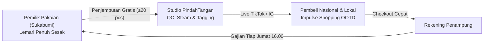
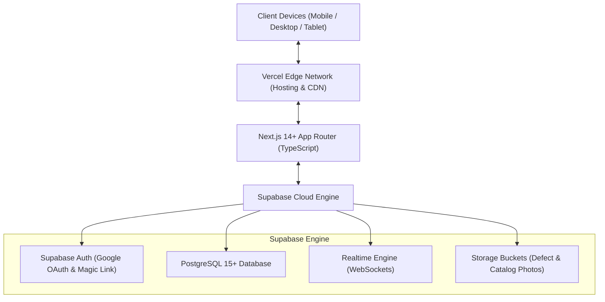
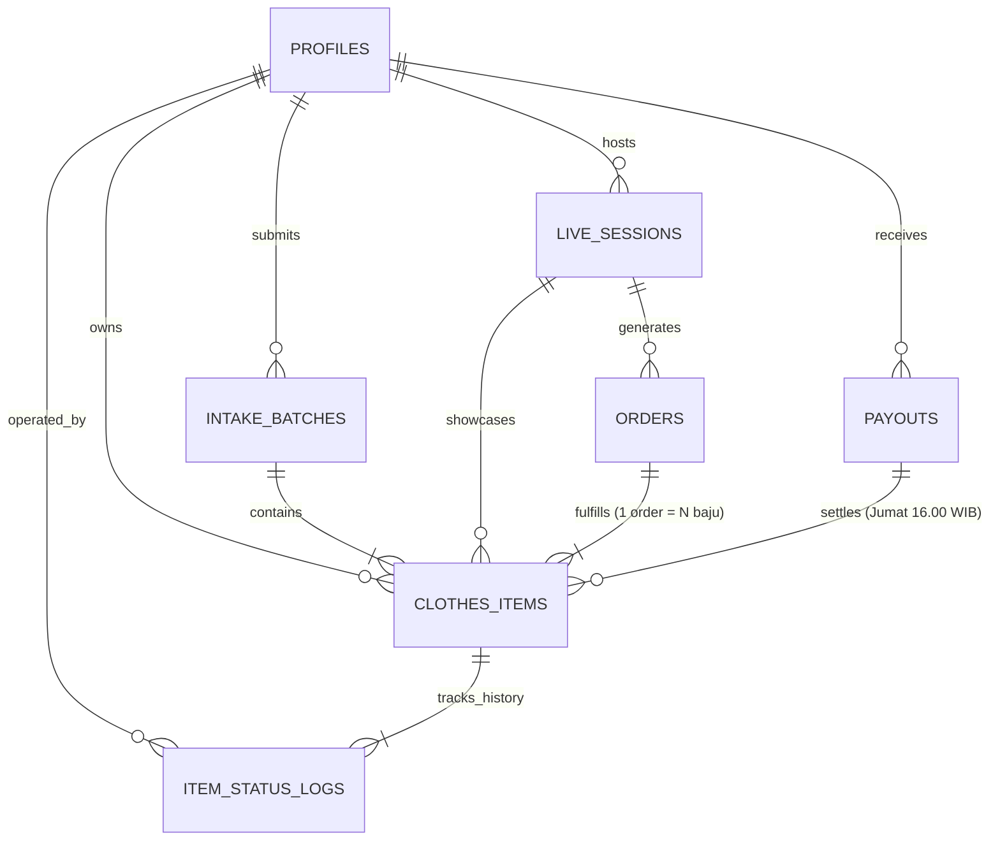
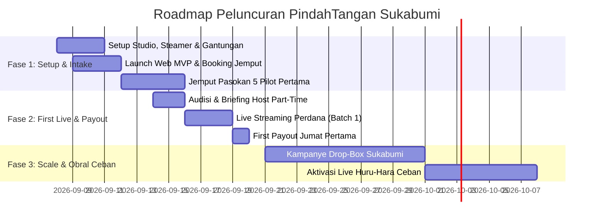

# 👗 MASTER PRODUCT REQUIREMENT DOCUMENT (PRD) v1.0
## PindahTangan — Managed Fashion Consignment & Live Circular Marketplace

> **Visi Platform:** *"Memberi Nafas Kedua untuk Pakaian Terbaikmu — Dari Lemarimu, Berpindah Tangan Jadi Cuan."*  
> **Status:** APPROVED & AUDITABLE (Double Re-Checked via `/grill-me`).  
> **Target Rilis MVP:** September 2026 (Fase 1: Kota Sukabumi).  
> **Aset Terkait:** [[30_Active Projects/PindahTangan - Entity Relationship Diagram (ERD) & Data Model|ERD & PostgreSQL Schema]] | [[PRD_PINDAHTANGAN_v1.0.pdf|Dokumen PDF Resmi]]

---

## 📑 DAFTAR ISI

1. **Executive Summary & Problem Space**
2. **User Persona & Detailed User Journeys**
3. **Arsitektur Teknis & Spesifikasi Tech Stack**
4. **Design Language & Visual System (Warm Editorial Chic)**
5. **SOP Operasional & Aturan Bisnis (The Engine)**
6. **Spesifikasi Fitur Lengkap (Functional Requirements)**
   * 6.1 Consignor Experience (Sisi Pemilik Pakaian)
   * 6.2 Studio Operator & Live Host Controller (Tablet Mode)
   * 6.3 Admin Backoffice & Batch Engine
7. **Entity Relationship Diagram (ERD) & Data Dictionary**
8. **Skrip DDL SQL Produksi (Supabase PostgreSQL)**
9. **Logika Finansial & Simulasi Unit Economics**
10. **Keamanan, Row Level Security (RLS) & Non-Functional SLAs**
11. **Roadmap Peluncuran 30 Hari (Sukabumi Pilot)**

---

## 1. Executive Summary & Problem Space

PindahTangan adalah platform *managed circular fashion consignment* (konsinyasi fesyen terkelola penuh) yang memadukan kenyamanan penjemputan barang ke rumah dengan kecepatan perputaran transaksi **Live Streaming Commerce (TikTok & Instagram Shopping)**.



### 1.1 Masalah Riil (The Grassroots Friction)
* **Sisi Penitip (Consignor / Pemilik Lemari):**
  * Rata-rata perempuan memiliki 20–50 potong pakaian layak pakai yang jarang disentuh di lemari.
  * 90% enggan menjual mandiri di Carousell/Shopee karena beban mental: harus memfoto 5 sudut, mengukur lingkar dada/panjang, meladeni negosiasi harga sadis, dan mengemas paket ke counter ekspedisi.
* **Sisi Pembeli (Buyer / Penonton Live):**
  * Minat perempuan terhadap pakaian OOTD murah sangat masif. Namun pakaian bekas impor (*bal segel*) kini rawan razia pemerintah, kebersihan/kesehatannya diragukan, dan ukurannya sering tidak konsisten.
* **Solusi PindahTangan (The Value Proposition):**
  * **Zero-Effort Consignment:** Pakaian dijemput ke rumah $\to$ diperiksa noda/kancing $\to$ disterilisasi cuci uap panas (*steam*) $\to$ diklasifikasikan ke etalase Live $\to$ dijual via Live TikTok oleh host lokal $\to$ uang ditransfer otomatis tiap Jumat sore.

---

## 2. User Persona & Detailed User Journeys

### 2.1 Persona Matrix

| Atribut | Persona 1: Si Pemilik Lemari (Consignor) | Persona 2: Si Pembeli Live (Buyer) | Persona 3: Si Host Live (Talent) |
| :--- | :--- | :--- | :--- |
| **Demografi** | Perempuan, 20–40 tahun, ibu muda / karyawati. | Perempuan, 18–35 tahun, mahasiswi / pekerja. | Perempuan, 19–25 tahun, mahasiswi Sukabumi. |
| **Karakter** | Lemari pakaian penuh, sibuk, tidak mau repot. | Hobi scroll TikTok malam hari, pemburu OOTD murah. | Percaya diri di depan kamera, luwes, modis. |
| **Motivasi Utama** | Lemari rapi dan pakaian berubah jadi uang tunai. | Mendapat pakaian branded mulus seharga Rp35rb–75rb. | Gaji per shift + bonus komisi per baju terjual. |
| **Pain Point** | Malas memfoto dan meladeni chat tawar-menawar. | Takut baju bekas kotor / ukuran tidak sesuai foto. | Butuh platform yang menyiapkan baju rapi siap display. |

### 2.2 User Journey Map (Pemilik Pakaian)
1. **Discovery:** Melihat konten Instagram/TikTok/WhatsApp tetangga tentang *"Layanan Jemput Lemari Sukabumi"*.
2. **Kalkulasi Cuan:** Menggeser slider di website PindahTangan: *"Punya 25 potong baju nganggur $\to$ Estimasi uang Rp 750rb – Rp 1,25 juta!"*.
3. **Booking Penjemputan:** Mengisi form booking penjemputan (alamat Sukabumi & waktu jemput).
4. **Penyerahan:** Kurir datang membawa kantong khusus, menghitung jumlah kasar, dan mengirimkan *Tanda Terima Digital* via WhatsApp.
5. **Pemantauan:** Pemilik login via Google OAuth ke portal untuk melihat proses QC, cuci uap, dan nomor gantungan live.
6. **Pencairan:** Menerima transferan otomatis setiap hari Jumat sore pukul 16.00 WIB beserta slip rincian di WhatsApp.

---

## 3. Arsitektur Teknis & Spesifikasi Tech Stack



| Lapisan (Layer) | Pilihan Teknologi | Spesifikasi & Rationale |
| :--- | :--- | :--- |
| **Frontend Framework** | **Next.js 14+ (App Router)** | Standar startup modern: SSR untuk landing page cepat & SEO, Client Components untuk dasbor reaktif. |
| **Bahasa Pemrograman** | **TypeScript (Strict Mode)** | Type-safety mutlak untuk struktur inventaris, skema harga, status pakaian, dan formula payout. |
| **Styling Engine** | **Tailwind CSS + Lucide Icons** | Kompilasi CSS tanpa runtime overhead, kustomisasi palet warna warm editorial, dan responsif mobile-first. |
| **Database Relasional** | **PostgreSQL 15+ (via Supabase)** | Skema ternormalisasi kuat, integritas Foreign Key, ACID transactions untuk gajian mingguan. |
| **Realtime Engine** | **Supabase Realtime (WebSockets)** | Event `UPDATE` pada tabel baju saat tombol 'MARK SOLD' ditekan host langsung memicu notifikasi visual di layar pemilik tanpa refresh. |
| **Autentikasi Pengguna** | **Supabase Auth** | **Google OAuth (1-Click Login)** & Email Magic Link. Tanpa ribet mengingat password rumit. |
| **Media Storage** | **Supabase Storage Buckets** | *Bucket `defect-photos`* (bukti cacat QC) dan *`catalog-items`* (thumbnail katalog). |
| **Deployment & Hosting** | **Vercel Production Edge** | Serverless edge functions, SSL HTTPS otomatis, dan optimasi gambar otomatis (`next/image` format WebP). |

---

## 4. Design Language & Visual System (Warm Editorial Chic)

PindahTangan membuang jauh-jauh kesan pasar loak atau pakaian bekas kumuh. Bahasa visual yang diusung adalah **"Warm Editorial & Sustainable Chic"**—butik kurasi yang ramah, bersih, hangat, dan berwibawa.

### 4.1 Token Warna Kustom (Tailwind Config)

```javascript
// tailwind.config.js
module.exports = {
  theme: {
    extend: {
      colors: {
        terracotta: {
          50: '#FDF4F2',
          100: '#FBE8E5',
          500: '#C25E43', // Brand Primary Accent
          600: '#B04F36',
          700: '#943F29',
        },
        linen: {
          50: '#FAF7F2',  // Canvas Background
          100: '#F5F0E6',
          200: '#E7E2D8', // Subtle Border
        },
        espresso: {
          900: '#1C1917', // Primary Text Heading
          700: '#44403C', // Body Text
          500: '#78716C', // Muted Text & Timestamps
        },
        sage: {
          500: '#849078', // Sustainable Accent
        }
      }
    }
  }
}
```

### 4.2 Tipografi & Gaya Komponen
* **Font Utama (Body, UI, & Angka):** `Plus Jakarta Sans` — bersih, modern, dan sangat nyaman dibaca di layar smartphone.
* **Font Aksen (Hero Headline & Editorial Quote):** `Playfair Display` — memberikan wibawa editorial butik majalah fesyen.
* **Kurvatur:** Menggunakan kurvatur organik (`rounded-2xl` pada kartu, `rounded-full` pada tombol aksi dan pill status).
* **Bayangan (Elevation):** Bayangan lembut hangat `shadow-[0_8px_30px_rgb(194,94,67,0.06)]`.
* **Touch Targets:** Seluruh tombol berukuran minimal $48 \times 48\text{ px}$.

---

## 5. SOP Operasional & Aturan Bisnis (The Engine)

### 5.1 SOP Intake & Penjemputan Hibrida
* **Batas Minimal Titip:** 10 potong pakaian per pengiriman.
* **Aturan Penjemputan:**
  * **$\ge 20$ Pcs:** Layanan **"Jemput Lemari" GRATIS** ke rumah di Kota Sukabumi oleh kurir internal.
  * **$< 20$ Pcs:** Diantar mandiri ke studio atau dikirim via Gosend/GrabExpress (ongkir ditanggung pemilik).

### 5.2 SOP Quality Control (QC) & Penanganan Reject
Setiap pakaian yang tiba di studio wajib melewati 3 stasiun kerja dalam tempo $1 \times 24$ jam:
1. **Stasiun 1: QC & Screening Kerusakan**
   * Pemeriksaan: noda permanen, robek/bolong, resleting rusak, kancing copot, bau apek.
   * **Aturan Barang Reject:**
     * Admin mengambil **1 foto jelas bagian cacat**.
     * Foto otomatis muncul di portal penitip dengan status: `⚠️ Tidak Lolos QC`.
     * Pemilik diberikan opsi di portal: **[Relakan untuk Didonasikan/Daur Ulang]** ATAU **[Ambil Kembali Saat Payout]**.
2. **Stasiun 2: Cuci Uap Panas (*Garment Steamer*)**
   * Pakaian disterilisasi menggunakan uap panas bersuhu $> 100^\circ\text{C}$ untuk membunuh bakteri, meluruskan kusut, dan disemprot pewangi *fabric mist* butik.
3. **Stasiun 3: Hangtagging & Barcoding**
   * Pakaian dipasang hangtag bernomor display besar (misal: `No. 42`) dan barcode SKU unik (`PT-SM-001-042`).

### 5.3 Klasifikasi 3-Tier Niche
Pakaian dikelompokkan ke dalam 3 tier jadwal siaran Live:
* **Tier A (Branded & Pesta):** Brand mall (Zara, Mango, Uniqlo), Gamis kondangan, Gaun pesta, Outer knit. Floor Price: Rp 50k–120k. Jadwal Live: Weekend / Malam (20.00–22.00).
* **Tier B (Casual Chic & Kerja):** Kemeja kerja, blouse katun, kulot linen, tunik harian. Floor Price: Rp 25k–45k. Jadwal Live: Harian Sore (16.00–18.00).
* **Tier C (Mass Market / Flash Sale):** Kaos basic, cardigan tipis, celana rumahan. Floor Price: Rp 10k–20k. Jadwal Live: Flash Sale Siang (14.00–16.00).

### 5.4 Retensi 30 Hari & Opsi Beli Putus Obral
* **Masa Konsinyasi Aktif:** **30 Hari Kalender**.
* **Jika Belum Laku di Hari ke-30:** Sistem mengaktifkan **Opsi Beli Putus Obral (Rp 5.000 – Rp 10.000/potong)**. Pemilik tetap menerima uang tunai daripada baju kembali mengotori lemari, dan platform memperoleh amunisi stok modal sangat murah untuk konten **Live Stream Huru-Hara "Serba Ceban (Rp10.000)"** yang secara algoritma sangat disukai TikTok!

---

## 6. Spesifikasi Fitur Lengkap (Functional Requirements)

### 6.1 Modul 1: Sisi Pemilik Pakaian (Consignor Web Experience)
1. **Interactive Closet Value Estimator:** Slider 10–100 pcs yang langsung mengkalkulasi estimasi uang tunai yang akan didapat.
2. **Booking Form "Jemput Lemari":** Input alamat Sukabumi, pin lokasi GPS, pilihan tanggal penjemputan, dan jumlah estimasi baju.
3. **Google 1-Click Auth:** Login cepat tanpa password rumit.
4. **Live Consignment Portfolio:**
   * Tab status: `🧺 Sedang Steam`, `👗 Siap Live Malam Ini (No. 42)`, `✅ Terjual (Rp 65.000)`.
   * **Viewer Foto Cacat QC:** Foto interaktif noda/sobekan untuk barang reject beserta tombol aksi donasi/retur.
5. **Payout Ledger & Bank Details:** Manajemen nomor rekening (BCA, Mandiri, BRI, e-wallet) dan riwayat slip bukti transfer PDF setiap Jumat sore.

### 6.2 Modul 2: Sisi Operator Studio & Host Live (Studio OS)
1. **Intake Batch Registration:** Pendaftaran kantong baru, pembuatan ID Penitip (`PT-SM-XXX`), dan verifikasi jumlah fisik.
2. **QC Inspection Station:** Interface input brand, ukuran, tier A/B/C, penetapan *Floor Price*, upload foto noda, dan generate hangtag.
3. **Host Live Controller (Tablet Run-Sheet Mode):**
   * Antarmuka layar sentuh tablet di ring-light host: menampilkan antrean gantungan baju berurutan (`No. 01`, `No. 02`, dst.).
   * Kartu informasi cepat: Brand, LD (Lingkar Dada), Floor Price, dan Rekomendasi Harga Buka Live.
   * Tombol satu ketukan: **`[ MARK SOLD ]`** (input handle TikTok pembeli + harga laku $\to$ otomatis update database Postgres dan saldo pemilik secara realtime).
   * Tombol **`[ SKIP / NEXT ]`** untuk menggeser antrean baju ke urutan belakang jika penonton belum berminat.
4. **Friday Payout Batch Engine:** Tombol satu klik untuk menghitung seluruh pakaian yang terjual periode Sabtu–Kamis, menghasilkan kode transfer, memotong fee steam Rp 2.500/pcs, dan mengaitkan ID payout.

---

## 7. Entity Relationship Diagram (ERD) & Data Dictionary

### 7.1 Visual ERD (Crow's Foot Notation)



### 7.2 Kamus Data 7 Entitas Inti

#### 1. `profiles` (Pengguna Multi-Role)
* `id` (UUID, PK, fk to `auth.users`): ID pengguna terverifikasi.
* `full_name` (TEXT, NOT NULL): Nama lengkap.
* `phone_number` (TEXT, UNIQUE, NOT NULL): Nomor WhatsApp.
* `address` (TEXT): Alamat rumah penjemputan.
* `city` (TEXT, DEFAULT 'Kota Sukabumi'): Kota domisili.
* `bank_name` (TEXT): Bank tujuan transfer (BCA, Mandiri, GoPay, OVO).
* `bank_account_number` (TEXT): Nomor rekening bank.
* `bank_account_holder` (TEXT): Nama pemilik rekening.
* `role` (user_role, DEFAULT 'consignor'): `consignor`, `host`, atau `admin`.

#### 2. `intake_batches` (Pengiriman Kantong Baju)
* `id` (UUID, PK): ID batch intake.
* `consignor_id` (UUID, FK to `profiles.id`): Pemilik baju.
* `batch_code` (TEXT, UNIQUE, NOT NULL): Kode kantong (`BATCH-202609-001`).
* `pickup_address` (TEXT, NOT NULL): Alamat penjemputan kurir.
* `pickup_date` (DATE): Jadwal penjemputan.
* `estimated_count` (INT, NOT NULL): Estimasi jumlah baju saat booking.
* `actual_count` (INT, DEFAULT 0): Jumlah fisik riil yang dihitung di studio.
* `status` (batch_status): `scheduled`, `picked_up`, `in_qc`, `completed`.

#### 3. `clothes_items` (Entitas Fisik Pakaian)
* `id` (UUID, PK): ID unik pakaian.
* `batch_id` (UUID, FK to `intake_batches.id`): Relasi ke batch kantong.
* `consignor_id` (UUID, FK to `profiles.id`): Pemilik baju.
* `live_session_id` (UUID, FK to `live_sessions.id`, NULL): Sesi live tempat baju dijual.
* `order_id` (UUID, FK to `orders.id`, NULL): Pesanan pembeli saat laku.
* `payout_id` (UUID, FK to `payouts.id`, NULL): Batch transfer Jumat saat dana dicairkan.
* `sku` (TEXT, UNIQUE, NOT NULL): Barcode fisik (`PT-SM-001-042`).
* `hangtag_number` (INT, NOT NULL): Nomor display hanger live (`42`).
* `title` (TEXT, NOT NULL): Deskripsi baju.
* `brand` (TEXT): Merek pakaian.
* `size` (TEXT): Ukuran pakaian.
* `category_tier` (tier_category, NOT NULL): `tier_a`, `tier_b`, `tier_c`.
* `floor_price` (NUMERIC(12,2), NOT NULL): Hak bersih pemilik yang disepakati.
* `target_live_price` (NUMERIC(12,2), NOT NULL): Rekomendasi harga buka Live.
* `sold_price` (NUMERIC(12,2)): Harga laku akhir di Live.
* `steam_fee` (NUMERIC(12,2), DEFAULT 2500): Biaya uap deduktif saat laku.
* `net_payout_amount` (NUMERIC(12,2)): Nilai transfer bersih (`floor_price - steam_fee`).
* `status` (item_status): `in_steam`, `ready_for_live`, `in_live_queue`, `sold`, `packed`, `shipped`, `paid_out`, `rejected`, `bought_out`.
* `defect_photo_url` (TEXT): URL foto cacat jika reject QC.
* `defect_notes` (TEXT): Catatan detail kerusakan.
* `reject_resolution` (reject_action): `donate` atau `reclaim`.
* `consignment_start_date` (DATE, DEFAULT CURRENT_DATE): Awal masa titip.
* `aging_expiry_date` (DATE): Jatuh tempo 30 hari (start + 30 days).

#### 4. `item_status_logs` (Audit Trail Timeline)
* `id` (UUID, PK): ID log.
* `item_id` (UUID, FK to `clothes_items.id`): Relasi ke pakaian.
* `changed_by` (UUID, FK to `profiles.id`): Operator/host pengubah status.
* `from_status` (TEXT): Status sebelumnya.
* `to_status` (TEXT, NOT NULL): Status baru.
* `notes` (TEXT): Keterangan peristiwa.
* `created_at` (TIMESTAMPTZ, DEFAULT NOW()): Timestamp persis.

#### 5. `orders` (Pesanan Pembeli Live)
* `id` (UUID, PK): ID pesanan.
* `live_session_id` (UUID, FK to `live_sessions.id`): Sesi siaran.
* `order_number` (TEXT, UNIQUE, NOT NULL): Kode pesanan (`ORD-202609-042`).
* `buyer_handle` (TEXT, NOT NULL): Username TikTok/IG pembeli (`@siti_ootd`).
* `buyer_name` (TEXT, NOT NULL): Nama penerima paket.
* `buyer_phone` (TEXT, NOT NULL): Nomor WA pembeli.
* `shipping_address` (TEXT, NOT NULL): Alamat kirim paket.
* `shipping_city` (TEXT, NOT NULL): Kota tujuan.
* `courier_name` (TEXT, NOT NULL): Ekspedisi (J&T, SiCepat, Gosend).
* `tracking_number` (TEXT): Nomor resi pengiriman.
* `shipping_status` (shipping_status): `pending_pack`, `shipped`, `delivered`, `returned`.
* `subtotal_amount` (NUMERIC(14,2), NOT NULL): Subtotal harga baju.
* `shipping_fee` (NUMERIC(12,2), DEFAULT 0): Ongkir pembeli.
* `total_paid` (NUMERIC(14,2), NOT NULL): Total dana diterima.

#### 6. `payouts` (Gajian Mingguan Jumat)
* `id` (UUID, PK): ID batch payout.
* `consignor_id` (UUID, FK to `profiles.id`): Pemilik penerima transfer.
* `payout_code` (TEXT, UNIQUE, NOT NULL): Kode transfer (`PAY-20260918-001`).
* `period_start` (DATE, NOT NULL): Awal periode penjualan (Sabtu lalu).
* `period_end` (DATE, NOT NULL): Akhir periode penjualan (Kamis ini).
* `total_gross_floor` (NUMERIC(14,2), NOT NULL): Total Floor Price baju terjual.
* `total_steam_deduction` (NUMERIC(12,2), NOT NULL): Potongan steam (Pcs $\times$ Rp 2.500).
* `total_net_payout` (NUMERIC(14,2), NOT NULL): Nilai bersih transferan bank.
* `items_count` (INT, NOT NULL): Jumlah baju yang dicairkan.
* `destination_bank` (TEXT, NOT NULL): Bank tujuan.
* `destination_account_number` (TEXT, NOT NULL): Nomor rekening tujuan.
* `destination_account_holder` (TEXT, NOT NULL): Nama pemilik rekening.
* `status` (payout_status): `draft`, `processing`, `transferred`, `failed`.
* `transfer_receipt_url` (TEXT): Bukti transfer bank.
* `transferred_at` (TIMESTAMPTZ): Waktu dana sukses dikirim.

#### 7. `live_sessions` (Sesi Siaran Host)
* `id` (UUID, PK): ID sesi live.
* `host_id` (UUID, FK to `profiles.id`): Host bertugas.
* `session_title` (TEXT, NOT NULL): Judul siaran live.
* `platform` (live_platform): `tiktok` atau `instagram`.
* `start_time` (TIMESTAMPTZ, NOT NULL): Waktu mulai siaran.
* `end_time` (TIMESTAMPTZ): Waktu selesai siaran.
* `total_items_sold` (INT, DEFAULT 0): Jumlah baju laku.
* `total_gmv` (NUMERIC(14,2), DEFAULT 0): Total omzet kotor sesi.
* `host_base_fee` (NUMERIC(12,2), DEFAULT 60000): Gaji pokok shift 2 jam.
* `host_commission_earned` (NUMERIC(12,2), DEFAULT 0): Bonus insentif host.

---

## 8. Skrip DDL SQL Produksi (Supabase PostgreSQL)

```sql
-- AKTIFKAN EXTENSION UUID
CREATE EXTENSION IF NOT EXISTS "uuid-ossp";

-- 1. ENUMS
CREATE TYPE user_role AS ENUM ('consignor', 'host', 'admin');
CREATE TYPE batch_status AS ENUM ('scheduled', 'picked_up', 'in_qc', 'completed');
CREATE TYPE tier_category AS ENUM ('tier_a', 'tier_b', 'tier_c');
CREATE TYPE item_status AS ENUM (
    'in_steam', 
    'ready_for_live', 
    'in_live_queue', 
    'sold', 
    'packed', 
    'shipped', 
    'paid_out', 
    'rejected', 
    'bought_out'
);
CREATE TYPE reject_action AS ENUM ('donate', 'reclaim');
CREATE TYPE shipping_status AS ENUM ('pending_pack', 'shipped', 'delivered', 'returned');
CREATE TYPE payout_status AS ENUM ('draft', 'processing', 'transferred', 'failed');
CREATE TYPE live_platform AS ENUM ('tiktok', 'instagram');

-- 2. TABEL PROFILES
CREATE TABLE profiles (
    id UUID PRIMARY KEY REFERENCES auth.users(id) ON DELETE CASCADE,
    full_name TEXT NOT NULL,
    phone_number TEXT UNIQUE NOT NULL,
    address TEXT,
    city TEXT DEFAULT 'Kota Sukabumi',
    bank_name TEXT,
    bank_account_number TEXT,
    bank_account_holder TEXT,
    role user_role DEFAULT 'consignor',
    created_at TIMESTAMPTZ DEFAULT NOW()
);

-- 3. TABEL INTAKE BATCHES
CREATE TABLE intake_batches (
    id UUID PRIMARY KEY DEFAULT uuid_generate_v4(),
    consignor_id UUID NOT NULL REFERENCES profiles(id) ON DELETE CASCADE,
    batch_code TEXT UNIQUE NOT NULL,
    pickup_address TEXT NOT NULL,
    pickup_date DATE,
    estimated_count INT NOT NULL,
    actual_count INT DEFAULT 0,
    status batch_status DEFAULT 'scheduled',
    created_at TIMESTAMPTZ DEFAULT NOW()
);

-- 4. TABEL LIVE SESSIONS
CREATE TABLE live_sessions (
    id UUID PRIMARY KEY DEFAULT uuid_generate_v4(),
    host_id UUID NOT NULL REFERENCES profiles(id),
    session_title TEXT NOT NULL,
    platform live_platform DEFAULT 'tiktok',
    start_time TIMESTAMPTZ NOT NULL,
    end_time TIMESTAMPTZ,
    total_items_sold INT DEFAULT 0,
    total_gmv NUMERIC(14, 2) DEFAULT 0,
    host_base_fee NUMERIC(12, 2) DEFAULT 60000,
    host_commission_earned NUMERIC(12, 2) DEFAULT 0
);

-- 5. TABEL ORDERS
CREATE TABLE orders (
    id UUID PRIMARY KEY DEFAULT uuid_generate_v4(),
    live_session_id UUID REFERENCES live_sessions(id),
    order_number TEXT UNIQUE NOT NULL,
    buyer_handle TEXT NOT NULL,
    buyer_name TEXT NOT NULL,
    buyer_phone TEXT NOT NULL,
    shipping_address TEXT NOT NULL,
    shipping_city TEXT NOT NULL,
    courier_name TEXT NOT NULL,
    tracking_number TEXT,
    shipping_status shipping_status DEFAULT 'pending_pack',
    subtotal_amount NUMERIC(14, 2) NOT NULL,
    shipping_fee NUMERIC(12, 2) DEFAULT 0,
    total_paid NUMERIC(14, 2) NOT NULL,
    created_at TIMESTAMPTZ DEFAULT NOW()
);

-- 6. TABEL PAYOUTS
CREATE TABLE payouts (
    id UUID PRIMARY KEY DEFAULT uuid_generate_v4(),
    consignor_id UUID NOT NULL REFERENCES profiles(id) ON DELETE CASCADE,
    payout_code TEXT UNIQUE NOT NULL,
    period_start DATE NOT NULL,
    period_end DATE NOT NULL,
    total_gross_floor NUMERIC(14, 2) NOT NULL,
    total_steam_deduction NUMERIC(12, 2) NOT NULL,
    total_net_payout NUMERIC(14, 2) NOT NULL,
    items_count INT NOT NULL,
    destination_bank TEXT NOT NULL,
    destination_account_number TEXT NOT NULL,
    destination_account_holder TEXT NOT NULL,
    status payout_status DEFAULT 'processing',
    transfer_receipt_url TEXT,
    transferred_at TIMESTAMPTZ,
    created_at TIMESTAMPTZ DEFAULT NOW()
);

-- 7. TABEL CLOTHES ITEMS
CREATE TABLE clothes_items (
    id UUID PRIMARY KEY DEFAULT uuid_generate_v4(),
    batch_id UUID NOT NULL REFERENCES intake_batches(id) ON DELETE CASCADE,
    consignor_id UUID NOT NULL REFERENCES profiles(id) ON DELETE CASCADE,
    live_session_id UUID REFERENCES live_sessions(id),
    order_id UUID REFERENCES orders(id),
    payout_id UUID REFERENCES payouts(id),
    sku TEXT UNIQUE NOT NULL,
    hangtag_number INT NOT NULL,
    title TEXT NOT NULL,
    brand TEXT,
    size TEXT,
    category_tier tier_category NOT NULL,
    floor_price NUMERIC(12, 2) NOT NULL,
    target_live_price NUMERIC(12, 2) NOT NULL,
    sold_price NUMERIC(12, 2),
    steam_fee NUMERIC(12, 2) DEFAULT 2500,
    net_payout_amount NUMERIC(12, 2),
    status item_status DEFAULT 'in_steam',
    defect_photo_url TEXT,
    defect_notes TEXT,
    reject_resolution reject_action,
    consignment_start_date DATE DEFAULT CURRENT_DATE,
    aging_expiry_date DATE DEFAULT (CURRENT_DATE + INTERVAL '30 days'),
    created_at TIMESTAMPTZ DEFAULT NOW()
);

-- 8. TABEL ITEM STATUS LOGS (AUDIT TRAIL)
CREATE TABLE item_status_logs (
    id UUID PRIMARY KEY DEFAULT uuid_generate_v4(),
    item_id UUID NOT NULL REFERENCES clothes_items(id) ON DELETE CASCADE,
    changed_by UUID NOT NULL REFERENCES profiles(id),
    from_status TEXT,
    to_status TEXT NOT NULL,
    notes TEXT,
    created_at TIMESTAMPTZ DEFAULT NOW()
);

-- 9. INDEKS PERFORMA QUERY
CREATE INDEX idx_clothes_consignor ON clothes_items(consignor_id);
CREATE INDEX idx_clothes_status ON clothes_items(status);
CREATE INDEX idx_clothes_hangtag ON clothes_items(hangtag_number);
CREATE INDEX idx_clothes_payout ON clothes_items(payout_id);
CREATE INDEX idx_orders_session ON orders(live_session_id);
CREATE INDEX idx_logs_item ON item_status_logs(item_id);

-- 10. AUTOMATIC AUDIT LOG TRIGGER
CREATE OR REPLACE FUNCTION log_clothes_status_change()
RETURNS TRIGGER AS $$
BEGIN
    IF (OLD.status IS DISTINCT FROM NEW.status) THEN
        INSERT INTO item_status_logs(item_id, changed_by, from_status, to_status, notes)
        VALUES (
            NEW.id,
            COALESCE(auth.uid(), NEW.consignor_id),
            OLD.status::TEXT,
            NEW.status::TEXT,
            'Perubahan status otomatis sistem PindahTangan'
        );
    END IF;
    RETURN NEW;
END;
$$ LANGUAGE plpgsql SECURITY DEFINER;

CREATE TRIGGER trg_clothes_status_change
AFTER UPDATE ON clothes_items
FOR EACH ROW EXECUTE FUNCTION log_clothes_status_change();
```

---

## 9. Logika Finansial & Simulasi Unit Economics

### 9.1 Formula Laba Bersih Platform per Pakaian
$$\begin{aligned}
\text{Gross Sale (Live)} &= P_{\text{sold}} \\
\text{Floor Price (Hak Bersih Pemilik)} &= P_{\text{floor}} \\
\text{Potongan Biaya Cuci Uap Deduktif} &= \text{Rp } 2.500 \\
\text{Net Transfer ke Pemilik} &= P_{\text{floor}} - \text{Rp } 2.500 \\
\text{Gross Margin Platform} &= (P_{\text{sold}} - P_{\text{floor}}) + \text{Rp } 2.500 \\
\text{Insentif Host Live} &= \text{Rp } 2.000 \\
\text{Net Profit Platform per Pcs} &= (P_{\text{sold}} - P_{\text{floor}}) + \text{Rp } 500
\end{aligned}$$

### 9.2 Simulasi Finansial 1 Sesi Live Streaming (2 Jam)
* **Kapasitas Gantungan Display:** 50 potong pakaian.
* **Volume Terjual (Sold Out):** **30 potong**.
* **Rata-rata Floor Price:** Rp 35.000.
* **Rata-rata Harga Laku Live:** Rp 65.000.
* **Breakdown Arus Kas Sesi:**
  * **Total Omzet GMV:** $30 \times \text{Rp } 65.000 = \mathbf{Rp\ 1.950.000}$.
  * **Transfer Hak Pemilik Baju:** $30 \times (\text{Rp } 35.000 - \text{Rp } 2.500) = \mathbf{Rp\ 975.000}$.
  * **Biaya Host (Gaji Pokok + Insentif):** $\text{Rp } 60.000 + (30 \times \text{Rp } 2.000) = \mathbf{Rp\ 120.000}$.
  * **Laba Kotor Platform:** $30 \times \text{Rp } 30.000 + (30 \times \text{Rp } 2.500) = \mathbf{Rp\ 975.000}$.
  * **Laba Bersih Bersih Platform:** $\text{Rp } 975.000 - \text{Rp } 120.000 = \mathbf{Rp\ 855.000\ \text{per sesi 2 jam}}$.

---

## 10. Keamanan, Row Level Security (RLS) & Non-Functional SLAs

1. **Row Level Security (RLS) Policies:**
   * Penitip pakaian *hanya* dapat membaca (`SELECT`) baris miliknya sendiri:
     ```sql
     CREATE POLICY "Consignors view own clothes" ON clothes_items
     FOR SELECT USING (auth.uid() = consignor_id);
     ```
   * Hanya role `admin` dan `host` yang memiliki hak akses mutasi (`INSERT`, `UPDATE`) pada status pakaian, pencatatan pesanan, dan trigger payout.
2. **Performa & Latensi:**
   * Respon API Edge $< 120\text{ ms}$ di jaringan 4G Indonesia.
   * Format gambar WebP otomatis via Next.js Image Optimization dengan resolusi retina display.
3. **Audit Trail Immutability:**
   * Tabel `item_status_logs` bersifat *append-only* (tidak boleh ada operasi `UPDATE` atau `DELETE` oleh siapapun).

---

## 11. Roadmap Peluncuran 30 Hari (Sukabumi Pilot)



---

## 🔗 Referensi Silang Vault
* [[30_Active Projects/PindahTangan - Entity Relationship Diagram (ERD) & Data Model|ERD & Data Model PindahTangan]]
* [[30_Active Projects/LapakTeras - Micro Retail Space Marketplace|LapakTeras Sukabumi]]
* [[70_Research/Ideasi Bisnis Indonesia & Validasi LapakTeras|Ideasi Bisnis Indonesia & Validasi LapakTeras]]
* [[60_Systems & Playbooks/Hallo Group OS - Product Definition & PRD|Hallo Group OS Schema Contract]]
