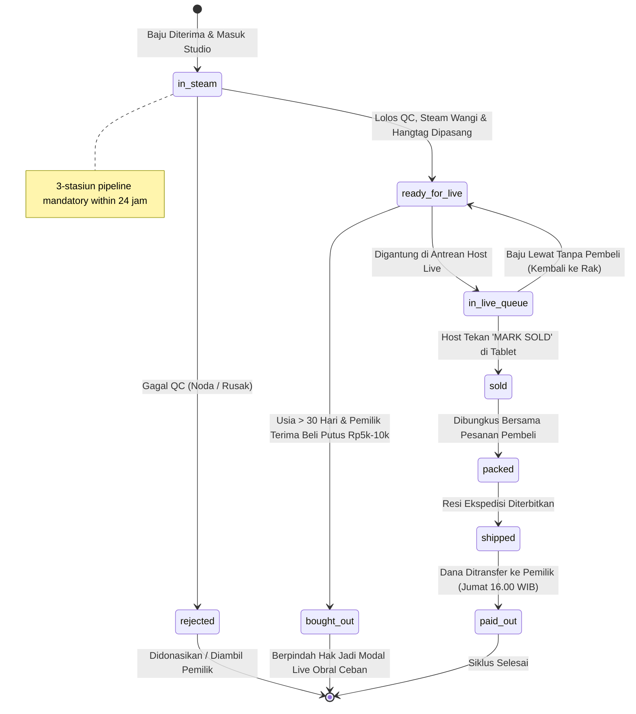

# PindahTangan P1 — Inventory, QC & Custody State-Machine Design

## Outcome

Define the durable item custody, QC status transitions, operator attribution, exception handling, and audit requirements that form the operational backbone before any controlled pilot can begin. This design must be verified and accepted before Gate B (controlled operational pilot) can pass.

## Definition of Done

- [ ] State machine diagram covers all `clothes_items.status` enum values with valid transition paths
- [ ] Every status transition has an assigned operator role and immutable audit log entry
- [ ] Exception paths (reject, buy-out, aging expiry) are documented with resolution options and ownership
- [ ] QC 3-station pipeline is encoded as a deterministic flow with entry/exit conditions
- [ ] 30-day aging engine logic is expressed with milestone warnings and buy-out activation
- [ ] Design reviewed and signed off by Ren (operational gate) and Lyra (technical execution)

## 1. Item Status State Machine

The `clothes_items.status` enum defines the complete lifecycle of a physical garment through the PindahTangan system. All transitions are deterministic, auditable, and operator-attributed.



### Status Definitions & Transition Rules

| Status | Entry Condition | Required Pre-Transition Actions | Exit Condition |
|--------|----------------|--------------------------------|----------------|
| `in_steam` | `actual_count` captured during intake; batch status `in_qc` | 3-stasiun QC pipeline completed (see §2) | Garment released from steam sterilization |
| `ready_for_live` | QC passed; hangtag attached; floor_price & target_live_price assigned | `consignment_start_date` set (DEFAULT CURRENT_DATE); `aging_expiry_date` computed (start + 30 days) | Garment displayed in live queue |
| `in_live_queue` | `ready_for_live`; assigned to live session run-sheet (No. 01–50) | Host has not marked `MARK SOLD` or `SKIP/NEXT` | Awaiting host decision during live broadcast |
| `sold` | Host pressed `MARK SOLD` on tablet; buyer handle + price recorded | `sold_price` set; `steam_fee` deducted automatically (Rp 2.500); `net_payout_amount` computed (`floor_price - 2500`) | Transaction recorded; order generated |
| `packed` | `sold`; barcode-scan verification passed (SKU match); buyer address/phone validated | `packed_by` (UUID, profiles.id) set; `packed_at` (TIMESTAMPTZ) set | Physical bundle ready for dispatch |
| `shipped` | `packed`; courier label printed; tracking number generated | `dispatched_at` (TIMESTAMPTZ) set; `courier_name` set; `tracking_number` set | Carrier has possession |
| `paid_out` | `shipped`; payout period closed (Jumat 16:00 WIB); batch reconciliation complete | `payout_id` linked; `transferred_at` (TIMESTAMPTZ) set; bank CSV generated; slip sent via WhatsApp | Funds transferred to consignor account |
| `rejected` | QC fail at stasiun 1; 1 defect photo uploaded; defect_notes + reject_resolution assigned | Operator selected: `donate` or `reclaim`; status set; notification sent to consignor portal | Garment removed from live cycle |
| `bought_out` | Aging expiry reached (hari >= 30); consignor accepted Rp 10.000 buy-out offer | `reject_resolution` = `reclaim` not selected; Rp 10.000 added to consignor payout; status transition; garment moved to "Serba Ceban" catalog | Ownership fully transferred to platform; Rp 10.000 credited |

### Invalid / Blocked Transitions

| From → To | Reason |
|-----------|--------|
| `in_steam` → `sold` | Must pass through `ready_for_live` → `in_live_queue` → `sold` |
| `ready_for_live` → `packed` | Must pass through `in_live_queue` → `sold` first |
| `sold` → `ready_for_live` | Permanent forward-only state |
| Any → `rejected` without QC | Must pass through stasiun 1 screening first |
| `bought_out` → any other status | Permanent terminal state (ownership transferred) |
| `paid_out` → any other status | Permanent terminal state (cycle completed) |

## 2. QC 3-Station Pipeline

Every garment passing through the studio must complete all three stations within **1 × 24 jam** from `picked_up` timestamp. Failure to complete within this window triggers a capacity exception.

### Stasiun 1: QC & Screening Kerusakan

**Parameters (5 checks):**
1. Noda permanen (tinta, minyak, jamur)
2. Sobek / bolong kain
3. Resleting macet / patah
4. Kancing utama hilang / copot
5. Bau apek membandel

**Outcomes:**
- **Lolos:** All 5 parameters passed → transition to `ready_for_live`
- **Reject:** Any parameter failed → operator uploads 1 defect photo; selects reject_resolution (`donate` or `reclaim`); writes defect_notes; status → `rejected`; auto-notification to consignor portal

**Exception:** If reject_resolution = `reclaim`, consignor can collect at studio; otherwise garment is donated/daur ulang.

### Stasiun 2: Cuci Uap Panas (*Garment Steamer*)

**Conditions:**
- Uap suhu > 100°C
- Penyemprotan *fabric mist* butik
- Kills bacteria, meluruskan kusut, memberikan wibawa parfum

**Outcome:** Garment transitions from `in_steam` → `ready_for_live` with hangtag attached.

**Failure:** If steamer malfunction or insufficient temperature, garment remains in `in_steam` and exception is logged; operator must resolve within 4 hours or escalate to studio lead.

### Stasiun 3: Hangtagging & Barcoding

**Output format:** Thermal label 10 × 15 cm standard printer POS/Thermal

**Label contents:**
- Nomor display gantungan besar: `No. XX` (contoh: `No. 42`)
- Barcode Code-128 & SKU fisik: `PT-SM-001-042`
- Brand, Ukuran, Lingkar Dada (LD cm)
- Floor Price & Rekomendasi Buka Live (hanya panduan operator)

**Outcome:** Garment receives physical hangtag; `hangtag_number` set in database; status can now advance to `ready_for_live`.

## 3. Inventory Custody & Operator Attribution

Every state change must be attributable to a specific operator via the `item_status_logs` audit trail.

### Audit Log Entry Schema

| Field | Type | Description |
|-------|------|-------------|
| `id` | UUID (PK) | Auto-generated log identifier |
| `item_id` | UUID (FK) | Related `clothes_items.id` |
| `changed_by` | UUID (FK) | `profiles.id` of the operator who made the change |
| `from_status` | TEXT | Status before transition |
| `to_status` | TEXT NOT NULL | Status after transition |
| `notes` | TEXT | Human-readable event description (optional) |
| `created_at` | TIMESTAMPTZ DEFAULT NOW() | Timestamp of transition (immutable) |

### Operator Role Matrix

| Role | Can Transiti | Can View | Can Escalate |
|------|-------------|----------|--------------|
| `consignor` | None (read-only portal) | Own items only | Submit reclaim requests |
| `host` | `sold` transitions only during live session | Own session's items | Mark `MARK SOLD` / `SKIP` |
| `studio_lead` | All status transitions | All items in studio | Override exceptions; reassign batches |
| `finance_admin` | `paid_out` batch execution | All payout records | Execute Friday payout batch |
| `superadmin` (Owner) | All transitions | All records | System-wide configuration |

**Attribution rule:** The `log_clothes_status_change()` trigger automatically captures `changed_by` as `COALESCE(auth.uid(), NEW.consignor_id)`, ensuring every transition is logged even when initiated through the browser store.

## 4. Exception Handling

### 4.1 Reject Exceptions

| Scenario | Resolution | Owner | Acceptance Test |
|----------|-----------|-------|-----------------|
| QC fail, consignor chooses `donate` | Garment donated; status → `rejected`; consignor receives no payout | Studio lead + Ren | Defect photo uploaded; notification sent; payout ledger unchanged |
| QC fail, consignor chooses `reclaim` | Garment available for collection at studio; status → `reclaimed` (temporary) | Consignor + Ren | Consignor can retrieve garment within 7 days; after 7 days auto-convert to `donate` |

### 4.2 Aging Expiry & Buy-Out

**Detection logic:**
```
Sisa Hari = aging_expiry_date - CURRENT_DATE
```

**Milestones:**
- **Hari 1–20:** Normal — garment eligible for Tier A/B/C live scheduling
- **Hari 21–29:** Kuning — dashboard warning: "Sisa 21–29 hari; diskon live 15% rekomendasi"
- **Hari >= 30:** Kadaluwarsa — buy-out offer otomatis

**Buy-out offer (Rp 10.000/potong):**
- Presented to consignor when `aging_expiry_date` reached
- If accepted: status → `bought_out`; Rp 10.000 added to consignor's next Friday payout; garment moved to "Serba Ceban" live catalog
- If rejected: garment continues in lifecycle but marked expired; platform may still accept for discount live with disclaimer

**Acceptance test:** When `aging_expiry_date` is reached and consignor accepts buy-out, item status changes to `bought_out` within 24 hours; Rp 10.000 appears in consignor's payout ledger; garment no longer appears in regular live queue.

### 4.3 Capacity Exceptions (24-Jam Window)

If a garment has not completed the 3-station QC pipeline within 24 jam from `pickup_date`:
- Status frozen at `in_qc`
- Studio lead notified via dashboard alert
- After 48 jam: automatic escalation to superadmin; garment may be released with documented exception
- After 72 jam: garment marked `rejected` with "Timeout: QC pipeline exceeded" notes; consignor notified

## 5. Audit Requirements

### 5.1 Immutable Audit Trail

- `item_status_logs` table is append-only: **NO UPDATE or DELETE permissions** for any role
- Every log entry includes: `item_id`, `changed_by`, `from_status`, `to_status`, `notes`, `created_at`
- Trigger `trg_clothes_status_change` fires `AFTER UPDATE ON clothes_items FOR EACH ROW`
- Log entries cannot be modified after creation; any attempt to corrupt triggers a security alert

### 5.2 Role-Based Audit Access

| Role | Can Read | Can Export | Can Delete |
|------|----------|------------|------------|
| `consignor` | Own items' status history only | Own payout CSV only | Never |
| `studio_lead` | All studio items' history | Studio daily export (CSV) | Never |
| `finance_admin` | Payout-related logs only | Batch payout CSV | Never |
| `superadmin` | All logs | Full audit export | Never (policy-enforced) |

### 5.3 Quarterly Audit Checklist

- [ ] All status transitions in the last quarter have a corresponding `item_status_logs` entry
- [ ] No `item_status_logs` entries missing `changed_by` or `created_at`
- [ ] All `rejected` items have defect_photo_url + defect_notes populated
- [ ] All `bought_out` items have consignor acceptance timestamp recorded
- [ ] 24-jam QC window compliance rate >= 95% (exception count / total items)
- [ ] All `paid_out` items have corresponding `payout_id` + `transferred_at` + bank CSV record

## 6. Design Decisions & Rationale

| Decision | Rationale |
|----------|-----------|
| **State machine is deterministic forward-only** | Prevents status conflicts; each garment has one clear path; auditable |
| **3-station QC pipeline hard-wired to 24-jam window** | Ensures operational velocity; prevents "stuck" inventory; matches SOP |
| **`rejected` has two-resolution path (`donate`/`reclaim`)** | Gives consignor agency; enables circular economy option; clarifies ownership |
| **Aging expiry at 30 days with Rp 10.000 buy-out** | Creates urgency; monetizes unsold inventory; aligns with live commerce economics |
| **All transitions attributed via database trigger** | Zero-config attribution; cannot be bypassed; immutable audit trail |
| **`paid_out` is terminal state** | Matches real-world payout cadence (weekly); prevents double-payment risk |
| **`bought_out` transfers ownership to platform** | Enables "Serba Ceban" catalog; recovers value from otherwise-wasted inventory |

## 7. Verification Checklist Before Gate B

Before the controlled operational pilot can begin, all of the following must be verified:

- [ ] State machine diagram reviewed and signed off by Ren and Lyra
- [ ] Database migration includes all enum values, trigger, and `item_status_logs` schema
- [ ] 24-jam QC window test: sample 10 items; verify all transition within window or exception logged
- [ ] Buy-out flow test: simulate aging expiry; verify Rp 10.000 added to consignor payout; status → `bought_out`
- [ ] Reject flow test: simulate QC fail; verify defect photo + notes; verify consignor notification; verify `rejected` status
- [ ] Operator role matrix tested: each role can only transition states they're authorized for
- [ ] Audit log immutability test: attempt UPDATE/DELETE on `item_status_logs`; verify blocked by RLS
- [ ] 30-day aging engine test: verify milestone warnings appear at Hari 21–29 and buy-out activates at >= 30
- [ ] End-to-end: item enters at `in_steam` → exits at `paid_out` or `bought_out` with complete audit trail

## References

- [Master PRD PindahTangan v1.0](file:///Users/akmalirsyadpermana/Downloads/Pindah%20Tangan/PindahTangan%20-%20Product%20Requirement%20Document%20%28PRD%29%20v1.0.md)
- [ERD & Data Model PindahTangan](file:///Users/akmalirsyadpermana/.hermes/profiles/ren/workspace/shared-brain/30_Active%20Projects/PindahTangan%20-%20Entity%20Relationship%20Diagram%20%28ERD%29%20%26%20Data%20Model.md)
- [Pilot Readiness Risk Register](file:///Users/akmalirsyadpermana/Downloads/Pindah%20Tangan/PindahTangan%20-%20Pilot%20Readiness%20Risk%20Register.md)
- [Product & UX Audit](file:///Users/akmalirsyadpermana/Downloads/Pindah%20Tangan/PindahTangan%20-%20Product%20%26%20UX%20Audit.md)
- [Admin Dashboard PRD](file:///Users/akmalirsyadpermana/Downloads/Pindah%20Tangan/PindahTangan%20-%20Admin%20Dashboard%20PRD%20v1.0.md)
- [Supabase DDL Migration](file:///Users/akmalirsyadpermana/Downloads/Pindah%20Tangan/supabase/migrations/01_initial_schema.sql)